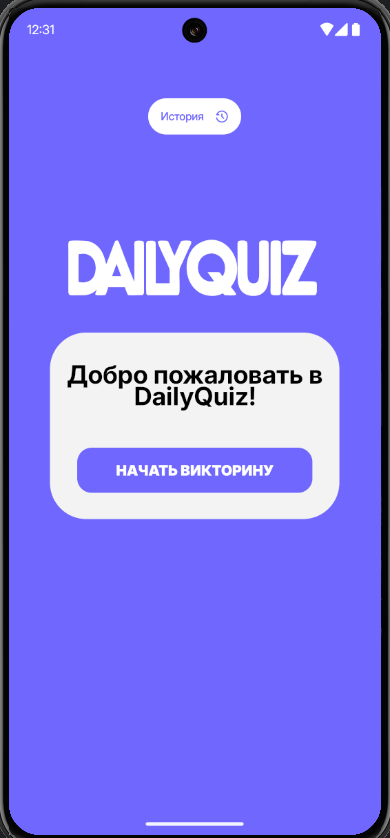
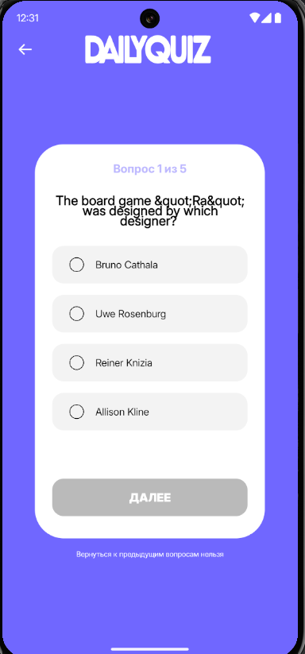
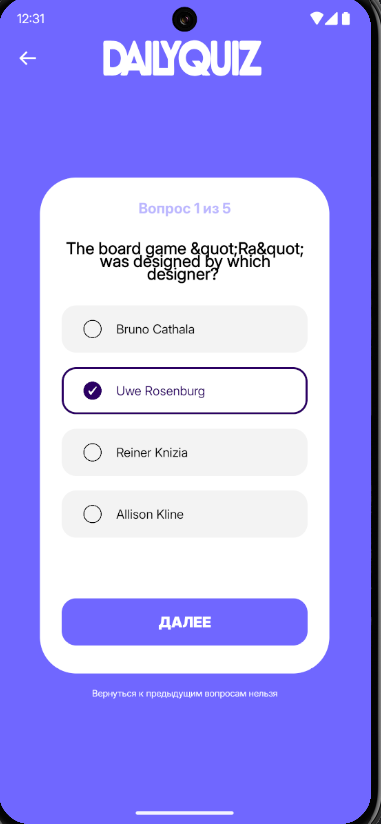
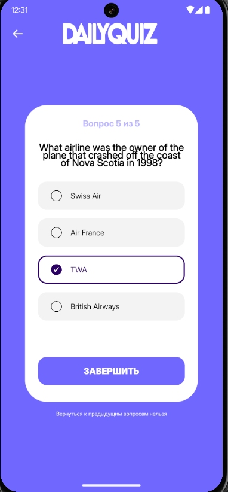
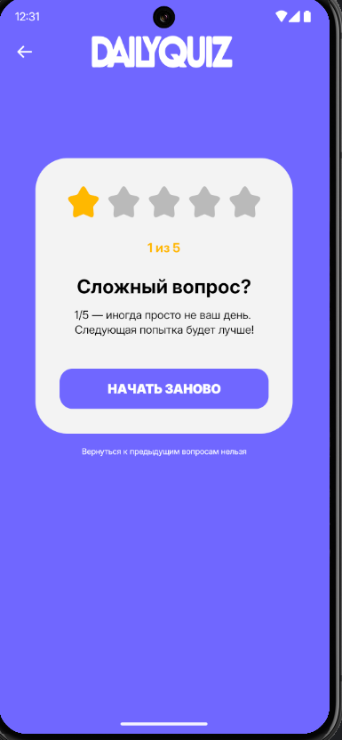

# Daily Quiz
Daily Quiz — приложение для прохождения коротких викторин. Пользователь может запустить викторину в любое время, пройти 5 вопросов и сохранить результат. 
Также доступна история предыдущих попыток с возможностью просмотра деталей.

## Скриншоты





## Функционал
- Запуск и прохождение викторины
- Сохранение результата прохождения с выбранными ответами
- Просмотр истории викторин
- Удаление результатов из истории

## Стек технологий:
- **Min SDK API – 24** — приложение поддерживает Android 6+
- **Kotlin v2.0.0+** — основной язык разработки
- **Kotlin Coroutines** — для работы с многопоточностью
- **MVVM + Clean + многомодульность** — архитектурные паттерны для разделения данных, логики и UI
- **Jetpack Compose** - для работы с View
- **Room Database** - для локального хранения данных
- **Gradle Kotlin DSL + Version Catalog (TOML)** - для работы с системой сборки gradle
- **StateFlow / ViewModel** — для реактивного обновления UI
- **JUnit4, Robolectric, Mockk** - unit-тесты

## Установка и запуск:

### 1. Клонируйте репозиторий:
```bash
git clone https://github.com/realism-dev/dailyquiz.git
```

### 2. Откройте проект в Android Studio:
В меню выберите File -> Open и выберите папку с клонированным проектом.

### 3. Синхронизируйте проект с Gradle:
После того как проект откроется, Android Studio предложит вам синхронизировать Gradle. Нажмите Sync Now.

### 4. Установите необходимые зависимости:
Проект использует несколько сторонних библиотек, указанных в файле build.gradle. Все они будут автоматически загружены при синхронизации Gradle.

### 5. Запуск приложения:
Подключите Android-устройство или запустите эмулятор.
Нажмите Run в Android Studio.

## [MIT License](https://github.com/realism-dev/DailyQuiz/blob/master/LICENSE)
